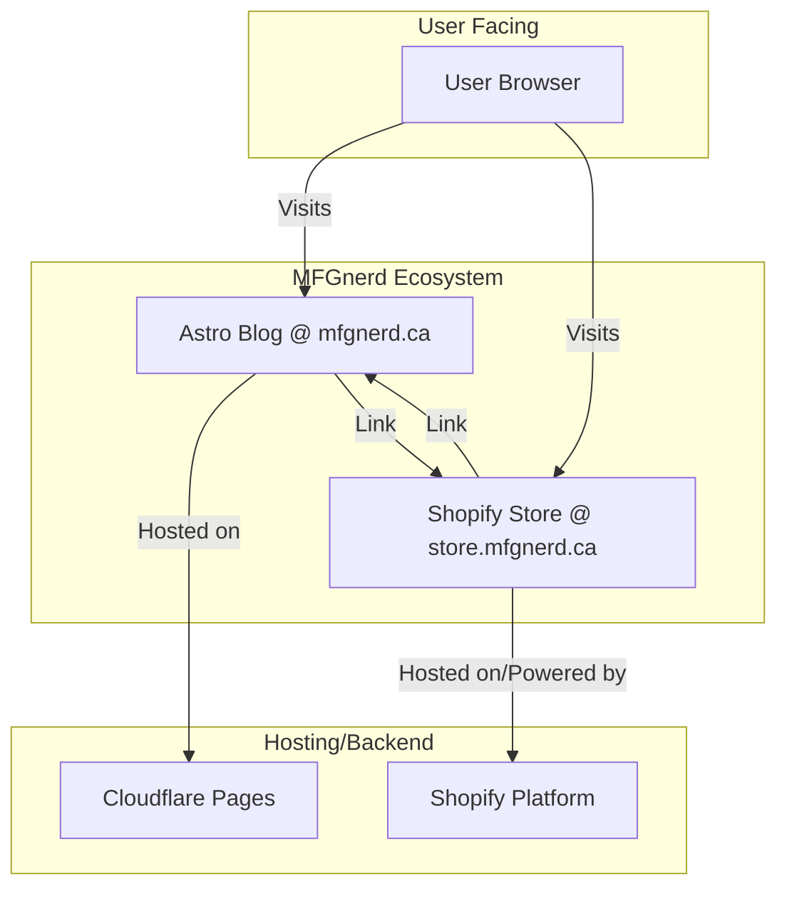

# System Patterns: MFGnerd Shopify Store

## 1. Architecture Overview

The chosen architecture involves two distinct, decoupled frontends:

1.  **Blog:** Existing Astro site (`mfgnerd.ca`) hosted on Cloudflare Pages. Remains technically independent.
2.  **Store:** New Shopify store (`store.mfgnerd.ca`) utilizing a customized Shopify theme (Dawn). Hosted by Shopify.

This decoupled approach prioritizes maintaining the performance and independence of the existing blog while leveraging Shopify's e-commerce platform for the store.

## 2. Key Technical Decisions

*   **Platform Choice:** Shopify selected for its robust e-commerce backend, checkout, and product management features.
*   **Theme Choice:** Shopify Dawn theme (OS 2.0) chosen as the base for customization due to its flexibility and adherence to modern Shopify standards. (Alternatives considered: Sense, Craft).
*   **Frontend Separation:** Deliberate decision *not* to use Shopify's built-in blog or pursue a headless architecture at this stage. This maintains blog performance/independence and simplifies initial store setup.
*   **Branding Implementation:** Theme customization will be achieved primarily through CSS overrides (for colors, fonts, layout adjustments) and JavaScript (for the theme toggle). Modifications to Liquid templates and JSON settings will be made as needed.
*   **Subdomain Strategy:** Using `store.mfgnerd.ca` is standard practice and facilitates the technical separation while maintaining brand coherence under the main domain.

## 3. Data Flow

*   **Blog:** Content managed within the Astro project's file system/CMS. Hosted statically.
*   **Store:** Product data, customer data, orders, and cart/checkout logic managed entirely within the Shopify platform. The customized theme reads and displays this data via Liquid and Shopify APIs.

## 4. Future Considerations

*   The decoupled architecture allows for the potential future creation of additional, separate Shopify stores (e.g., `hydrosnap.ca`) without impacting the initial `store.mfgnerd.ca` setup.
*   Migration to a unified headless architecture is possible later but would require significant development effort. The current separation does not preclude this.
